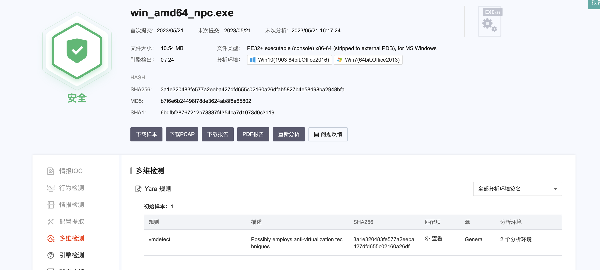
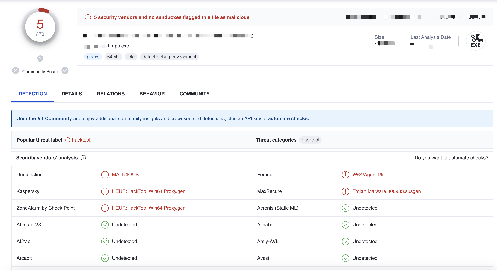
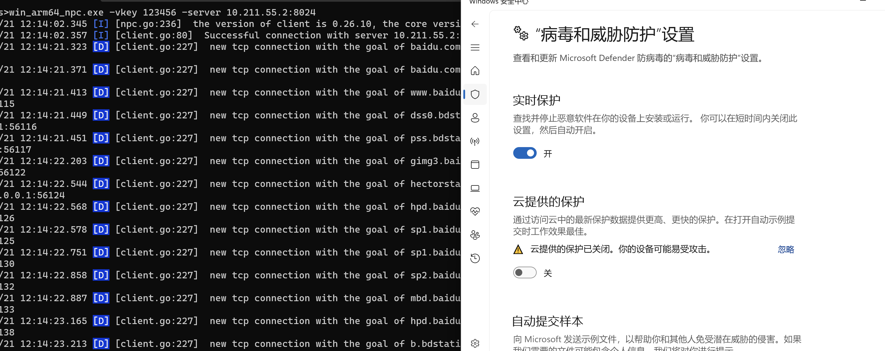
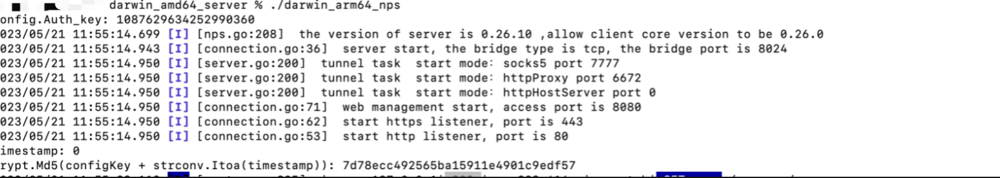
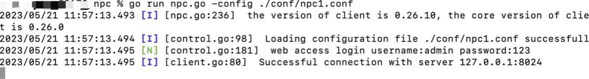
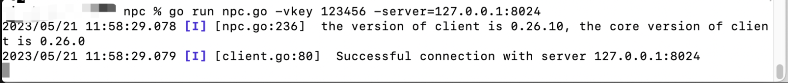

# Disclaimer 🧐
This tool is only for the most legally authorized enterprise security construction behavior. If you need to test the availability of this tool, please build your own target environment.

When using this tool for testing, you should ensure that the behavior complies with local laws and regulations and that you have obtained sufficient authorization. **Do not scan unauthorized targets**.

If you use this tool in the process of any illegal behavior, you must bear the corresponding consequences, we will not bear any legal and joint liability.

Before installing and using this tool, please be sure to read carefully and fully understand the contents of the terms, restrictions, disclaimers or other terms involving your significant rights and interests may be highlighted in bold, underlined and other forms. Unless you have fully read, fully understood and accepted all terms of this Agreement, you are advised not to install and use this Tool. Your use of this Agreement or your acceptance of this Agreement by any other express or implied means shall be deemed that you have read and agree to be bound by this Agreement.


# Tool source and description

```

(1) nps communication traffic is relatively stable, but the features are relatively dead, so secondary development is carried out based on the original nps

```

### Description

In order to kill the tool and its later modification, I do not open source. ** I promise that the tool is non-toxic and can only be simply opened

# Magic part

```
(1) The authentication process of nps is rewritten, and the communication process is encrypted

(2) The npc part is heavier, and it is expected to separate the config file for loading in the future

(3) The nps unauthorized vulnerability was repaired to avoid the default configuration of unauthorized

(4) The config file is loaded from a remote end and traffic encryption is implemented during transmission

```


# No-kill situation
(This is the demo after the magic change, please also test do not ☁️ test, sandbox test, networking test)
### After the magic change traffic
The tool traffic after the magic change will not be crawled, if needed, you can test yourself.


### A community ☁️ sandbox (demo test)


### virustotal


### windows defender (static)


### windows defender (Dynamic)



### 360, Tinder and other soft kill were not tested


# Project Usage
The registration of the nps server has not been tested, so it is still mainly run as./nps
## Server use

**Server use precautions**

```
(1) When using the server, you need to down the conf and web directories
(2) Put the conf and web directories at the same level as the nps directory
(3) Change the server password (md5 may be supported later, or change the password after login)
```





## Client use

### Profile launch
The configuration file is as follows:
```
[common]
Server_addr = 127.0.0.1:8024
conn_type=tcp
vkey=123456
auto_reconnection=true
max_conn=1000
flow_limit=1000
rate_limit=1000
web_username=admin
web_password=123
crypt=true
compress=true
# pprof_addr = 0.0.0.0:9999
disconnect_timeout=60

```


### Command line startup


### The command line starts with a remote configuration file

```
npc.exe -rconfig ServerConfig address
eg.
npc.exe -rconfig 127.0.0.1:23123
```


# Project progress

Due to personal reasons, the late maintenance of this project will be carried out after mid-June.

✅ 2023.5.19 The communication authentication protocol is rewritten

✅ 2023.5.20 Confuses the connection traffic. You can only start the client by running the CLI, not by running the conf file

✅ 2023.5.21 Supports loading the local config file

✅ 2023.5.23 The config file **only** can be pulled from the server only

✅ 2023.5.30 The traffic is modified again due to deep confusion

# Subsequent additions
(1) ~~Implement the magic change of other protocol traffic~~
# Reference
```
https://github.com/ehang-io/nps
```
